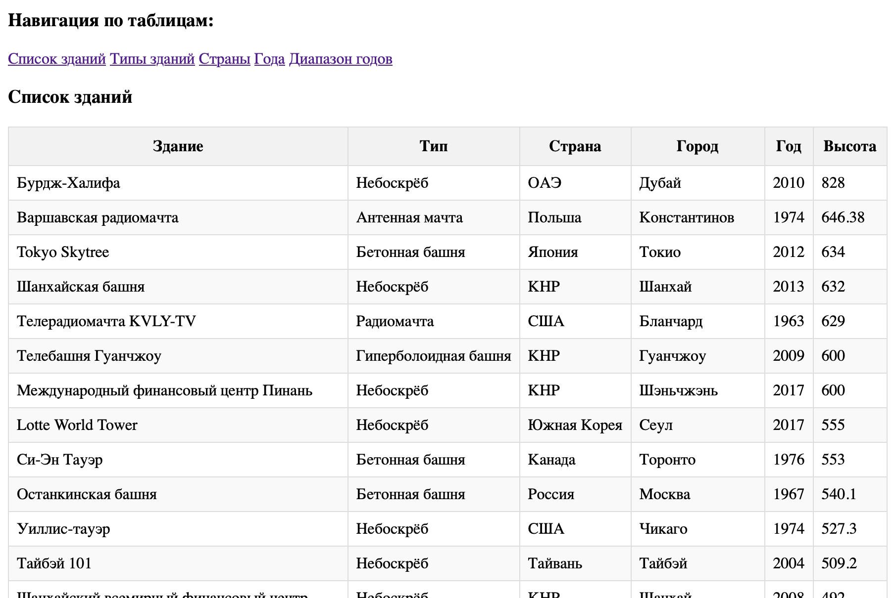
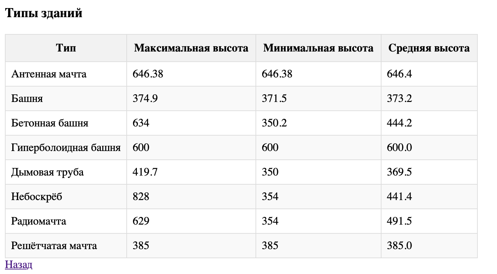
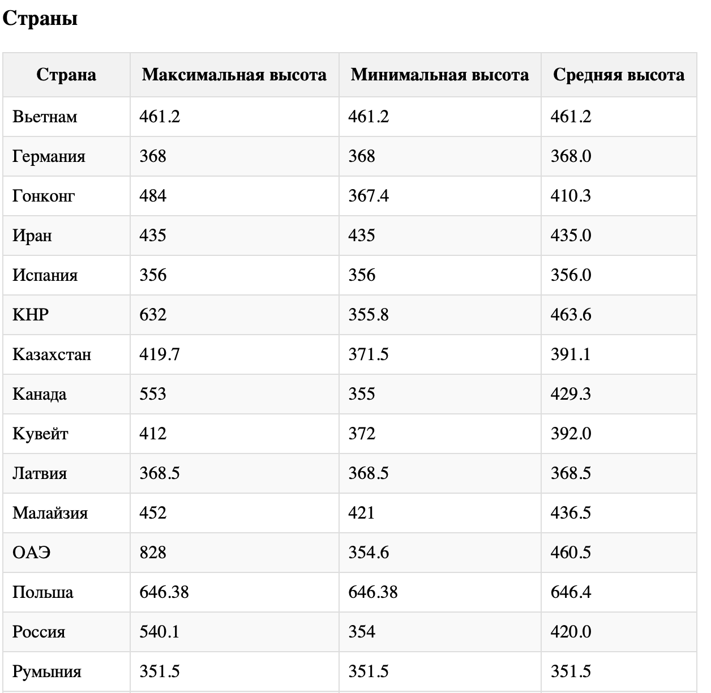
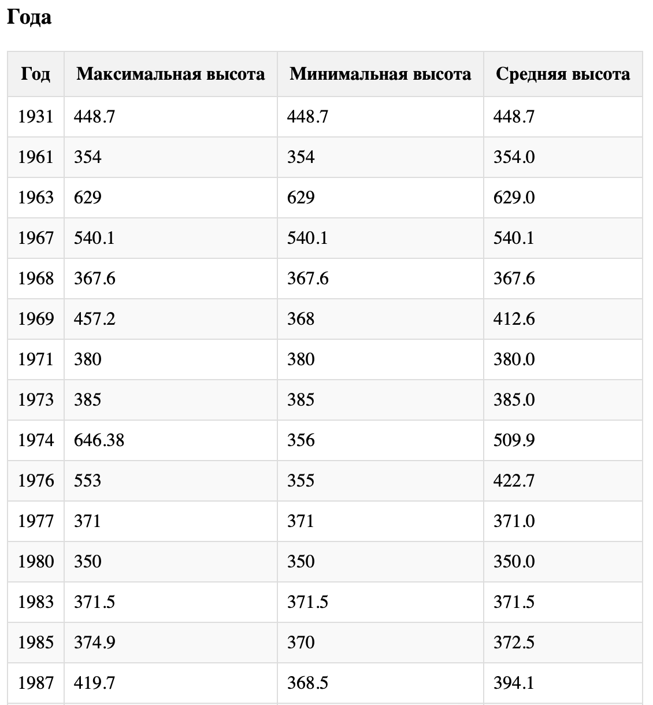
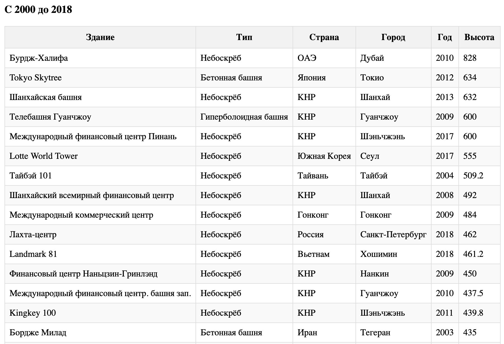

# Lab-1

В данном репозитории выполнены Workshop и Лабораторная работа 1











Года для функция с выборкой представлены в качестве ее параметров.

``` python
def get_bulding_for_range_of_year(startYear, endYear):
    query = (
        db.session.query(
            Building.title.label("Здание"),
            TypeBuilding.type.label("Тип"),
            Country.name.label("Страна"),
            City.name.label("Город"),
            Building.year.label("Год"),
            Building.height.label("Высота")
          )
        .select_from(Building)
        .filter((Building.year >= startYear) & (Building.year <= endYear))
        .join(TypeBuilding)
        .join(City)
        .join(Country)
    )
    return [query.statement.columns.keys(), query.all()]
```

Заголовок для таблицы строится следующим образом:

``` html
<h3 id="range-years">С {{startYear}} до {{endYear}}</h3>
```
